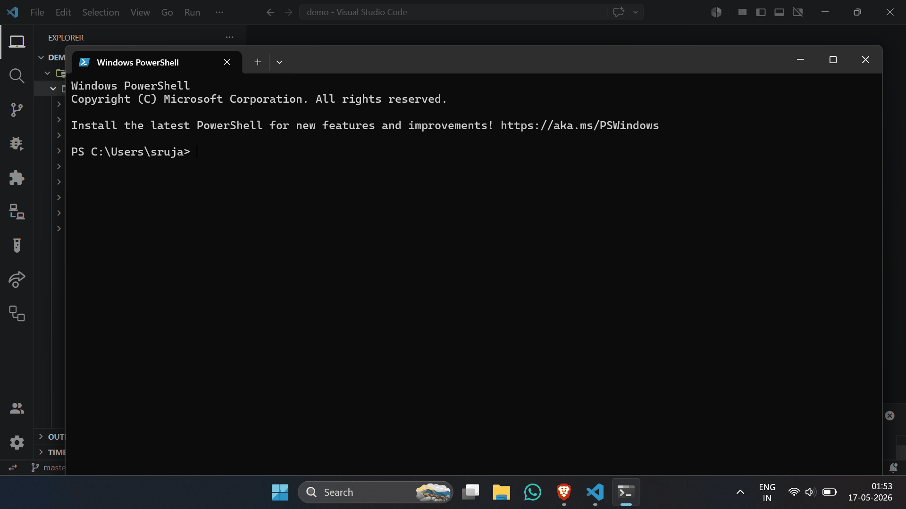
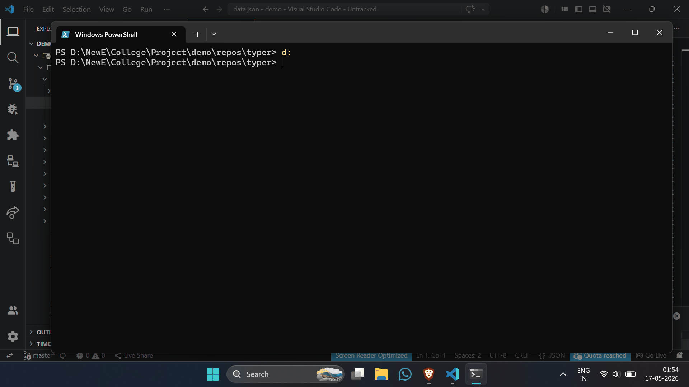
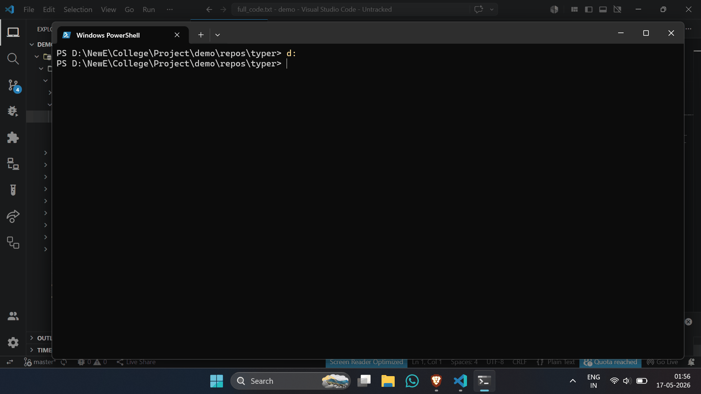

# 🧠 project-brain

> **Local-first developer intelligence CLI for semantic repository analysis, Git-aware code understanding, and AI-friendly engineering workflows.**


[](https://project-brain-web-gamma.vercel.app/)

---

## 🚀 What is project-brain?

`project-brain` is a CLI-first developer intelligence tool built for analyzing codebases, tracking Git changes at function level, generating structured exports for AI systems, and explaining code changes using optional LLM integrations.

Unlike traditional Git tooling that operates on raw line diffs, project-brain uses AST-based parsing to understand code structure and produce developer-friendly insights.

The project is designed around a **local-first**, **privacy-friendly**, and **AI-optional** workflow.

---

# 🎯 Why project-brain Exists

Modern development workflows suffer from several problems:

### Git diffs are noisy

Traditional diffs show line changes, not semantic meaning.

A small refactor can generate large diffs while hiding the actual behavioral impact.

---

### Codebases become difficult to understand

Large repositories contain:

* deeply nested modules
* duplicated logic
* unclear ownership
* hidden dependencies

Understanding them manually is slow.

---

### AI tools require structured context

Most AI systems perform poorly when fed raw repositories.

project-brain creates:

* structured exports
* focused change sets
* function-level intelligence
* AI-friendly context

---

# ✨ Features

## Implemented

* 🔍 Recursive repository scanning
* 🧠 AST-based Python analysis
* 🧩 Function extraction
* 🏛️ Class extraction
* 🔄 Git diff parsing
* 📌 Function-level change tracking
* 📦 AI-friendly code export system
* 🤖 Optional LLM explanations
* 💾 Explanation caching
* 🌐 HTML diff reports
* ⚠️ Config validation
* 🩺 Environment diagnostics
* 🪵 Persistent logging
* 🚫 Binary file skipping
* 🛡️ Invalid Python safety handling
* ⚡ Deep directory traversal

---

# ⚙️ Installation
## Requirements

* Python >= 3.10
* Git installed
* Optional:

  * Ollama
  * OpenAI API access
  * Gemini API access
  * HuggingFace API access

---

## Install from PyPI

```bash
pip install project-brain-cli
```

---

## Verify Installation

```bash
brain --version
```

---

## Upgrade

```bash
pip install --upgrade project-brain-cli
```
---

## CLI Aliases

Both commands work:

```bash
brain
```

```bash
project-brain
```

---

# ⚡ Quick Start (30 Seconds), [For More INFO Click](https://project-brain-web-gamma.vercel.app/)

---

## 1. Initialize project-brain

```bash
brain project init
```
Demo:
---

---
Creates:

```text
.brain/
brain.yaml
```

---

## 2. Analyze Repository

```bash
brain project analyze .
```
Demo:
---

---
Performs:

* recursive scan
* AST parsing
* metadata generation

Stores results inside:

```text
.brain/data.json
```

---

## 3. Inspect Git Changes

```bash
brain diff show
```
Demo:
---

---
Default behavior:

```text
HEAD~1 → HEAD
```

Shows:

* modified files
* added files
* deleted files
* function-level changes

---

## 4. Export AI-Friendly Context

```bash
brain export full-code
```
Demo:
---

---
Creates:

```text
.brain/exports/full_code.txt
```
---
## 5. Diagnostics

Validate project readiness:

```bash
brain project doctor
```
Demo:
---

---
Checks:

- git availability
- project initialization
- analysis freshness
- export availability
- provider configuration
- API key presence

---

## 6. Access Community Resources

```bash
brain community
```
Demo:
---

---
Open feedback/discussions directly:

```bash
brain --feedback
```

---

# 🧪 LLM Commands

---

## `brain testllm test`

Test provider connectivity.

### Syntax

```bash
brain testllm test
```

---

### What It Does

* loads provider config
* sends test prompt
* validates response
* optionally fetches model list

---

### Disabled Mode

If:

```yaml
provider: none
```

Output:

```text
LLM disabled
```

---

# ⚙️ Configuration

Configuration file:

```text
brain.yaml
```

---

# Example Configuration

```yaml id="g8r7wq"
version: "1.1.0"

llm:
  provider: none
  model: ""
  timeout_sec: 60

analysis:
  depth: fast
  include_tests: false

  ignore:
    - .brain/
    - .git/
    - node_modules/
    - venv/
    - .venv/
    - __pycache__/
    - env/
    - .env/
    - project_brain_cli.egg-info/
    - tests/
    - test/

diff:
  mode: function

export:
  full_code:
    include_tests: false
    max_file_size_kb: 200

  manual_add:
    allow_duplicates: true

  changes:
    mode: function
    include_context: true
    output_path: .brain/exports/code_changes.txt

  ignore:
    - .brain/
    - .git/
    - node_modules/
    - venv/
    - .venv/
    - __pycache__/
    - env/
    - .env/
    - project_brain_cli.egg-info/
    - tests/
    - test/

explain:
  level: detailed
  include_risks: true

output:
  format: text
```

---

# 🔑 API Key Setup

Secrets should NEVER be stored inside `brain.yaml`.

---

## Windows CMD

```bash
setx OPENAI_API_KEY "your_key"
```

```bash
setx GEMINI_API_KEY "your_key"
```

```bash
setx HUGGINGFACE_API_KEY "your_key"
```

---

## PowerShell

```powershell
[Environment]::SetEnvironmentVariable("OPENAI_API_KEY","your_key","User")
```

---

## Linux/macOS

```bash
export OPENAI_API_KEY="your_key"
```

---

# 📴 Offline Mode

project-brain fully supports offline workflows.

Use:

```yaml
llm:
  provider: none
```

Behavior:

* no API calls
* no cloud dependency
* local-only analysis
* fallback explanations enabled

---

# 📄 Example Outputs

---

## Analysis

```text
🔍 Analyzing: .

📋 File Paths:
src/api.py
src/utils.py

✅ Analysis complete
```

---

## Diff Review

```text
Function: create_user

Change:
Added validation layer

Impact:
Improves input integrity

Risk:
medium
```

---
# 🏗️ Architecture

```text
CLI Layer
│
├── Analyzer Engine
├── Diff Engine
├── Explain Engine
├── Export Engine
├── Diagnostics Layer
├── Config Validation
├── Logging System
└── LLM Provider Layer
```

---

# 🔄 Supported Providers

| Provider | Supported |
|---|---|
| OpenAI | ✅ |
| Ollama | ✅ |
| Gemini | ✅ |
| HuggingFace | ✅ |
| Offline Mode | ✅ |

---

# 🪵 Logging System

Logs stored inside:

```text
.brain/logs.txt
```

Tracks:

* warnings
* provider failures
* parsing errors
* export failures
* cache issues

Logging failures never crash the CLI.

---

# 🛠️ Troubleshooting

---

## ❌ Not a git repository

Initialize git:

```bash
git init
```

---

## ❌ Invalid git reference

Check refs:

```bash
git log --oneline
```

---

## ❌ Empty export

Possible causes:

* ignored paths
* file size limits
* tests excluded

---

## ❌ Provider failures

Check:

* API keys
* internet connectivity
* provider model name

---

## ❌ Missing API key

Verify environment variable:

```bash
echo %OPENAI_API_KEY%
```

---

# 🧪 Testing & QA

Current QA status:

* 18 automated tests passing
* export validation
* function diff validation
* config validation
* edge-case handling
* provider fallback testing

---
# 🔮 Roadmap

## Near-Term

* semantic diff intelligence
* integration tests
* incremental analysis
* performance improvements
* rename detection

---

## Mid-Term

* multi-language parsing
* plugin architecture
* dependency graphing
* richer semantic indexing

---

# 🔐 Security & Privacy

project-brain is designed with a local-first philosophy.

Key principles:

* no automatic code uploads
* offline workflows supported
* API keys via environment variables only
* repository data stored locally

LLM usage is fully optional.

---

# 🤝 Contributing

Contributions are welcome.

Recommended workflow:

```bash
git checkout -b feature/my-feature
```

Guidelines:

* keep PRs focused
* preserve CLI consistency
* add tests for new logic
* avoid unnecessary dependencies

---

# 📜 License

MIT License

---

# 🧠 Final Positioning

> project-brain is a local-first developer intelligence CLI that transforms repositories and Git diffs into structured, explainable engineering context.
