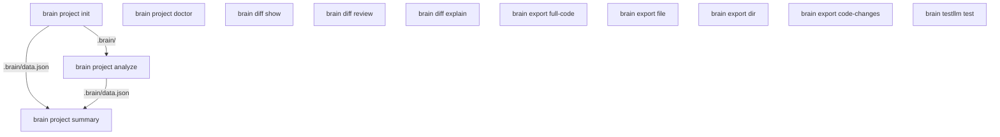

# Data Flow

## System Graph

## brain project init

**Produces**

- .brain/
- .brain/cache/
- .brain/data.json
- .brain/index.json
- brain.yaml

**Workflow**

1. `brain project init`
2. `brain project analyze`
3. `brain project summary`

## brain project analyze

**Prerequisites**

- brain project init

**Consumes**

- .brain/
- source code

**Produces**

- .brain/data.json

**Workflow**

1. `brain project init`
2. `brain project analyze`
3. `brain project summary`

## brain project summary

**Prerequisites**

- brain project analyze

**Consumes**

- .brain/data.json

**Produces**

- terminal summary

**Workflow**

1. `brain project analyze`
2. `brain project summary`

## brain project doctor

**Consumes**

- repository configuration

**Produces**

- health report

**Workflow**

1. `brain project doctor`

## brain diff show

**Consumes**

- git repository
- git history

**Produces**

- terminal diff report

**Workflow**

1. `brain diff show`

## brain diff review

**Prerequisites**

- brain testllm test

**Consumes**

- git history

**Produces**

- .brain/reports/*.json
- .brain/reports/*.html

**Workflow**

1. `brain diff show`
2. `brain diff review`

## brain diff explain

**Prerequisites**

- brain testllm test

**Consumes**

- source code

**Produces**

- terminal explanation

**Workflow**

1. `brain project analyze`
2. `brain diff explain`

## brain export full-code

**Consumes**

- repository source code

**Produces**

- .brain/exports/full_code.txt

**Workflow**

1. `brain project analyze`
2. `brain export full-code`

## brain export file

**Consumes**

- single file

**Produces**

- .brain/exports/manual_export.txt

**Workflow**

1. `brain export file`

## brain export dir

**Consumes**

- directory

**Produces**

- .brain/exports/manual_export.txt

**Workflow**

1. `brain export dir`

## brain export code-changes

**Prerequisites**

- brain diff show

**Consumes**

- git history

**Produces**

- .brain/exports/code-changes.txt

**Workflow**

1. `brain diff show`
2. `brain export code-changes`

## brain testllm test

**Prerequisites**

- brain project init
- brain project doctor

**Consumes**

- llm configuration

**Produces**

- provider connectivity report

**Workflow**

1. `brain testllm test`
2. `brain diff review`
