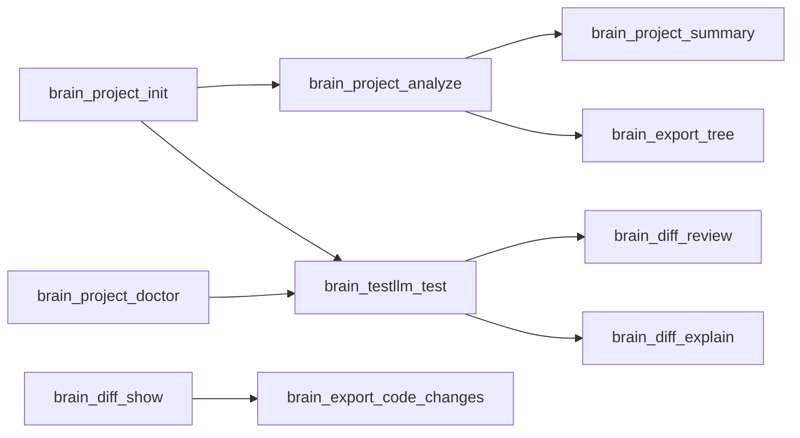

# Command Lifecycle

## Dependency Graph

## brain project init

### Workflow

1. `brain project init`
2. `brain project analyze`
3. `brain project summary`

## brain project analyze

### Prerequisites

- brain project init

### Workflow

1. `brain project init`
2. `brain project analyze`
3. `brain project summary`

## brain project summary

### Prerequisites

- brain project analyze

### Workflow

1. `brain project analyze`
2. `brain project summary`

## brain project doctor

### Workflow

1. `brain project doctor`

## brain diff show

### Workflow

1. `brain diff show`

## brain diff review

### Prerequisites

- brain testllm test

### Workflow

1. `brain diff show`
2. `brain diff review`

## brain diff explain

### Prerequisites

- brain testllm test

### Workflow

1. `brain project analyze`
2. `brain diff explain`

## brain export full-code

### Workflow

1. `brain project analyze`
2. `brain export full-code`

## brain export file

### Workflow

1. `brain export file`

## brain export dir

### Workflow

1. `brain export dir`

## brain export code-changes

### Prerequisites

- brain diff show

### Workflow

1. `brain diff show`
2. `brain export code-changes`

## brain export tree

### Prerequisites

- brain project analyze

### Workflow

1. `brain project analyze`
2. `brain export tree`

## brain testllm test

### Prerequisites

- brain project init
- brain project doctor

### Workflow

1. `brain testllm test`
2. `brain diff review`
