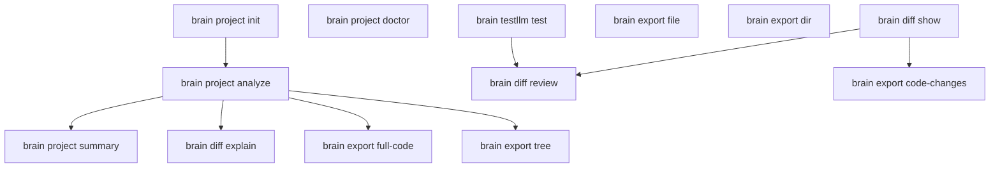

# Workflow Relationship Graph

This graph shows how commands are linked through the `workflow` metadata.

```mermaid
graph TD
    brain_project_init["brain project init"]
    brain_project_init --> brain_project_analyze
    brain_project_analyze --> brain_project_summary
    brain_project_analyze["brain project analyze"]
    brain_project_summary["brain project summary"]
    brain_project_doctor["brain project doctor"]
    brain_diff_show["brain diff show"]
    brain_diff_review["brain diff review"]
    brain_diff_show --> brain_diff_review
    brain_diff_explain["brain diff explain"]
    brain_project_analyze --> brain_diff_explain
    brain_export_full_code["brain export full-code"]
    brain_project_analyze --> brain_export_full_code
    brain_export_file["brain export file"]
    brain_export_dir["brain export dir"]
    brain_export_code_changes["brain export code-changes"]
    brain_diff_show --> brain_export_code_changes
    brain_export_tree["brain export tree"]
    brain_project_analyze --> brain_export_tree
    brain_testllm_test["brain testllm test"]
    brain_testllm_test --> brain_diff_review
```