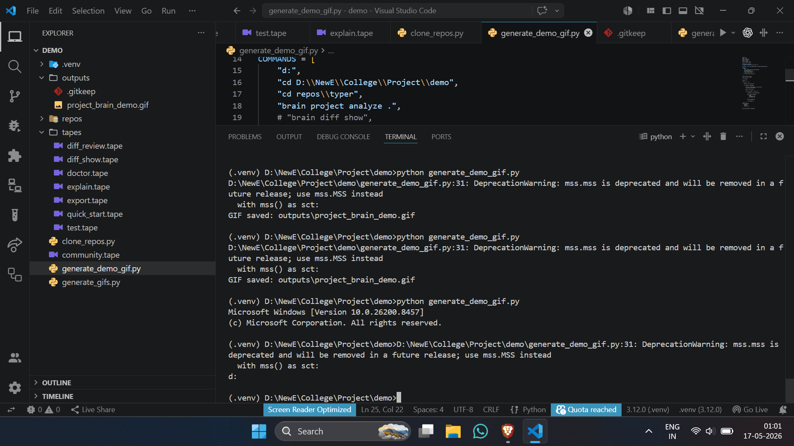

# brain diff explain

## Purpose

Explain a file or function

---

## Syntax

    brain diff explain

---

## Parameters

| Name | Type | Required | Kind | Default | Description |
|---|---|---|---|---|---|
| target | str | Yes | argument | REQUIRED | File path or file:function target |

---

## Examples

- brain diff explain src/main.py
- brain diff explain src/main.py:function_name

---

## Outputs

_None_

---

## Related Commands

- brain diff review

---

## Error Codes

_None_

---

## Notes

- Supports file-level and function-level explanation.

---

## Edge Cases

- Function name must exist in file.

---

## Demo

