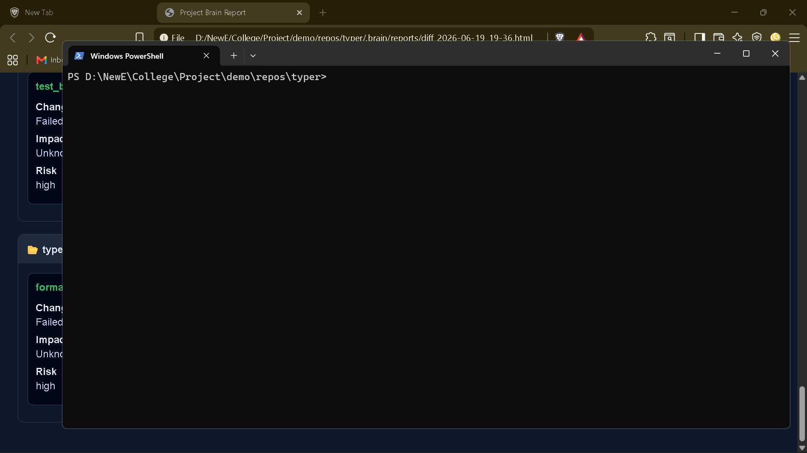

# `brain diff explain`

> Explain a file or function

---

## Overview

Explain a file or function

---

## When to use

This command is part of the **diff** workflow.

---

## Syntax

```bash
brain diff explain [options]
```

---

## Parameters

| Parameter | Type | Required | Default | Description |
|-----------|------|:--------:|---------|-------------|
| `target` | `str` | ✓ | `—` | File path or file:function target |

---

## Examples

```bash
brain diff explain src/main.py
```
```bash
brain diff explain src/main.py:function_name
```

---

## Outputs

_None_

---

## Errors

_None_

---

## Related commands

- `brain diff review`

---

## Notes

- Supports file-level and function-level explanation.

---

## Edge cases

- Function name must exist in file.

---

## Demo




---

## Usage Guide

### When would I use this?

Use `brain diff explain` when you need to understand the logic, intent, or structural changes within a specific file or a designated function. It is ideal for onboarding into a new codebase, reviewing complex legacy logic, or verifying that a code segment performs as intended after refactoring.

### How it fits in the workflow

This command acts as a diagnostic bridge between raw source code and developer comprehension. It integrates into your development loop after identifying a code area of interest through a `diff` or version control check. It serves as a pre-review tool to generate natural language insights before committing changes or initiating a formal code review with `brain diff review`.

### Practical tips

*   **Target specific units:** Use the `file:function` syntax to avoid cognitive overload. By scoping the analysis to a single function, the output remains focused on immediate logic rather than file-wide context.
*   **Iterate during refactoring:** Run the command before and after making logic changes to ensure the "explanation" aligns with your intended architectural updates.
*   **Use with version control:** Pipe the output into documentation files or PR comments when you need to explain complex implementation details to other team members.

### Common failure causes

*   **Invalid Target Path:** Providing a file path that does not exist or is inaccessible by the current environment.
*   **Missing Function Scope:** Referencing a function name that is not present or is misspelled within the specified file.
*   **Non-parseable Source:** Attempting to explain binary files, non-source assets, or code written in unsupported languages where the internal parser cannot build a symbol tree.

### FAQ

**Can I run this on multiple files at once?**
No, the command accepts a single `target` parameter at a time. Run the command sequentially for each file or function of interest.

**Does this modify my source code?**
No, the command only consumes the source code and produces a text-based explanation in your terminal.

**What happens if the function is nested?**
The command expects a standard `file:function` format. If the function is deeply nested within a class, ensure the syntax aligns with the specific parser’s requirements for identifier resolution.
