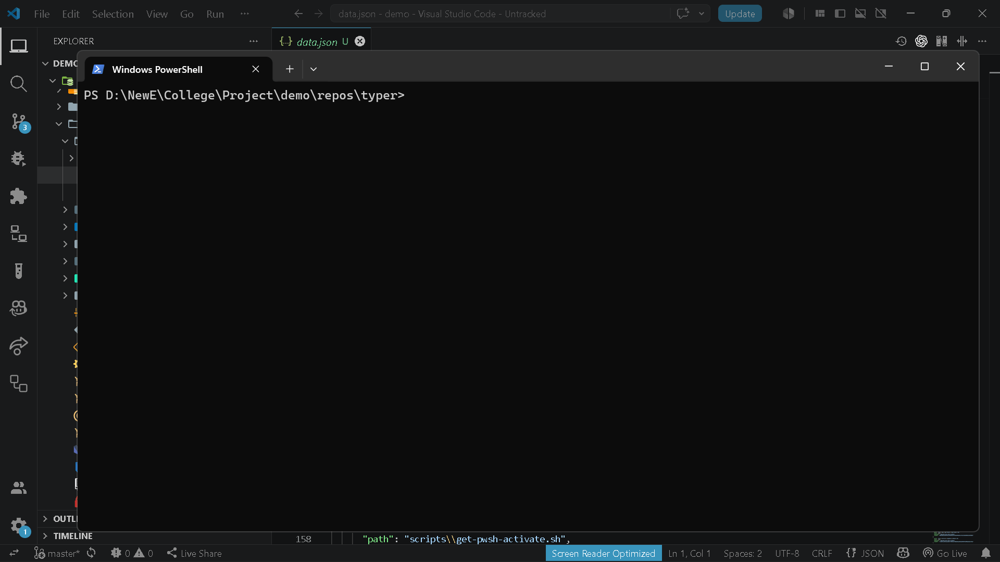

# `brain diff review`

> Explain code changes using LLM

---

## Overview

Explain code changes using LLM

---

## When to use

This command is part of the **diff** workflow.

---

## Syntax

```bash
brain diff review [options]
```

---

## Parameters

| Parameter | Type | Required | Default | Description |
|-----------|------|:--------:|---------|-------------|
| `from_ref` | `str` |  | `—` | Starting git reference |
| `to_ref` | `str` |  | `—` | Ending git reference |

---

## Examples

```bash
brain diff review
```
```bash
brain diff review HEAD~1 HEAD
```

---

## Outputs

- `.brain/reports/*.json`
- `.brain/reports/*.html`

---

## Errors

| Code | Description |
|------|-------------|
| `INVALID_GIT_REF` | Invalid git reference. |
| `LLM_PROVIDER_FAILURE` | LLM provider request failed. |

---

## Related commands

- `brain diff show`
- `brain export code-changes`

---

## Notes

- Uses configured LLM provider to explain changes.

---

## Edge cases

- Large diffs may increase LLM response time.

---

## Demo




---

## Usage Guide

### When would I use this?

Use `brain diff review` when you need to generate an AI-powered summary of code changes between two points in your git history. It is ideal for drafting pull request descriptions, conducting quick code audits, or documenting the evolution of a feature without manually analyzing every line of a diff.

### How it fits in the workflow

1. **Development**: Complete your work and commit your changes.
2. **Review**: Execute `brain diff review` to generate analytical reports based on your git history.
3. **Artifact Generation**: The tool automatically consumes your local git repository state and produces structured documentation in `.brain/reports/` as JSON and HTML files.
4. **Integration**: Use the generated reports to inform team discussions or attach the summarized insights to your version control hosting platform.

### Practical tips

*   **Specify Ranges**: Use explicit references like `brain diff review branch-a branch-b` to isolate specific feature development cycles rather than relying on defaults.
*   **Keep Diffs Focused**: Large diffs can increase LLM processing time significantly; perform reviews on smaller, logical commit ranges to ensure high-quality, actionable insights.
*   **Review Outputs**: Always inspect the files generated in `.brain/reports/` to verify the context, as the output quality is dependent on the provided LLM provider's interpretation.

### Common failure causes

*   **INVALID_GIT_REF**: This occurs if the provided `from_ref` or `to_ref` does not exist in your local repository or is formatted incorrectly.
*   **LLM_PROVIDER_FAILURE**: This occurs when the configured LLM API is unreachable, authentication credentials are invalid, or rate limits have been exceeded.

### FAQ

**Does this command modify my source code?**
No. It only reads your git history and creates report files within the `.brain/reports/` directory.

**Can I run this without arguments?**
Yes. If no references are provided, the command will attempt to use default git references to determine the scope of the diff.

**What formats are produced?**
The command produces both `.json` files for programmatic consumption and `.html` files for human-readable documentation.

**Does it require an internet connection?**
Yes, because it consumes the git history and sends the diff data to an external LLM provider to generate the analysis.
