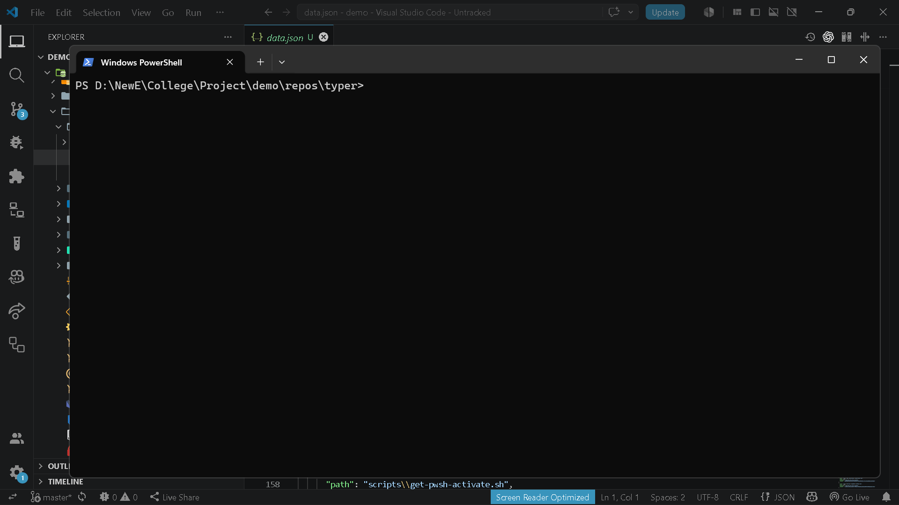

# `brain diff show`

> Show semantic git differences between references.

---

## Overview

Show semantic git differences between references.

---

## When to use

This command is part of the **diff** workflow.

---

## Syntax

```bash
brain diff show [options]
```

---

## Parameters

| Parameter | Type | Required | Default | Description |
|-----------|------|:--------:|---------|-------------|
| `from_ref` | `str` |  | `—` | Starting git reference |
| `to_ref` | `str` |  | `—` | Ending git reference |

---

## Examples

```bash
brain diff show
```
```bash
brain diff show HEAD~3 HEAD
```
```bash
brain diff show main dev
```

---

## Outputs

_None_

---

## Errors

| Code | Description |
|------|-------------|
| `INVALID_GIT_REF` | Invalid git reference. |
| `NOT_GIT_REPO` | Current directory is not a git repository. |

---

## Related commands

- `brain diff review`
- `brain export code-changes`

---

## Notes

- Supports file-level and function-level diff modes.

---

## Edge cases

- Requires valid git history.

---

## Demo




---

## Usage Guide

### When would I use this?

Use `brain diff show` to identify semantic changes between two git references. It is ideal for code reviews, auditing logic transformations between commits, or comparing the state of two branches to understand functional shifts beyond simple line-based diffs.

### How it fits in the workflow

1.  **Consumes**: Git repository and git history.
2.  **Processing**: The command analyzes code structure and semantic intent across the specified references.
3.  **Produces**: A terminal diff report detailing the functional changes, which can then be passed to `brain diff review` for deeper analysis or exported via `brain export code-changes`.

### Practical tips

*   **Scoped Analysis**: Use `brain diff show HEAD~3 HEAD` to quickly assess the functional impact of your last three local commits before pushing.
*   **Branch Comparison**: Compare two branches using `brain diff show main dev` to prepare a summary of changes for a pull request.
*   **Granularity**: Leverage the tool's ability to switch between file-level and function-level modes to focus on specific blocks of logic rather than broad syntax changes.

### Common failure causes

*   **NOT_GIT_REPO**: Executing the command outside of a directory initialized as a git repository.
*   **INVALID_GIT_REF**: Providing branch names, tags, or commit hashes that do not exist or are mistyped.
*   **Missing History**: Attempting to run the command on a repository that lacks sufficient git history to perform a meaningful comparison.

### FAQ

**Does this command show line-by-line git diffs?**
No, it focuses on semantic differences. For raw line-by-line changes, standard git tooling is recommended, while this command highlights functional shifts.

**What happens if I don't provide any arguments?**
The command will default to a comparison based on the current working state of your repository.

**Can I use this on non-code files?**
The tool is optimized for code analysis. Performance and accuracy may vary significantly when used on binary files or non-code documentation formats.
