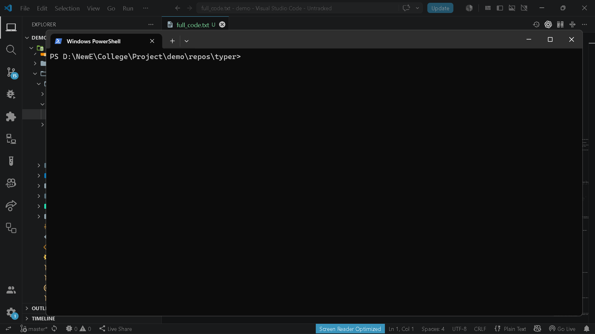

# `brain export code-changes`

> Export changed code between two git references

---

## Overview

Export changed code between two git references

---

## When to use

This command is part of the **export** workflow.

---

## Syntax

```bash
brain export code-changes [options]
```

---

## Parameters

| Parameter | Type | Required | Default | Description |
|-----------|------|:--------:|---------|-------------|
| `from_ref` | `str` | ✓ | `—` | Starting git reference |
| `to_ref` | `str` | ✓ | `—` | Ending git reference |

---

## Examples

```bash
brain export code-changes HEAD~1 HEAD
```

---

## Outputs

- `.brain/exports/code-changes.txt`

---

## Errors

| Code | Description |
|------|-------------|
| `INVALID_GIT_REF` | Invalid git reference. |

---

## Related commands

- `brain diff show`
- `brain diff review`

---

## Notes

- Exports changed files between git references.

---

## Edge cases

- Requires valid git history.

---

## Demo




---

## Usage Guide

### When would I use this?

Use `brain export code-changes` when you need to generate a portable text record of all modifications made between two specific git references (commits, branches, or tags). This is useful for code audits, sharing delta reports with stakeholders, or maintaining a documentation trail of incremental updates.

### How it fits in the workflow

1.  **Preparation**: Ensure your local repository has the necessary `git history` to resolve the `from_ref` and `to_ref` identifiers.
2.  **Execution**: Run the command to capture the specific changes.
3.  **Consumption**: The tool processes the git history and generates a standardized file at `.brain/exports/code-changes.txt`.
4.  **Integration**: Use this file for external reviews or archiving.

### Practical tips

*   **Specify Ranges**: Use standard git syntax (e.g., `HEAD~5` or specific commit hashes) to define the boundaries of the export.
*   **Version Control**: Because the output is saved to `.brain/exports/`, ensure you are aware of your project's `.gitignore` status if you intend to track the export files themselves.
*   **Verification**: After running, verify the output file existence to confirm the export process completed successfully.

### Common failure causes

*   **INVALID_GIT_REF**: The most common error occurs when one or both of the provided references do not exist in the current local repository or are formatted incorrectly.
*   **Missing History**: The command requires sufficient `git history` to calculate the delta; shallow clones or incomplete repositories may fail to produce the expected output.

### FAQ

**Q: Where is the exported data saved?**
A: All output is automatically directed to `.brain/exports/code-changes.txt`.

**Q: Can I change the output filename?**
A: No, the output path and filename are fixed by the command definition.

**Q: Does this command modify my git history?**
A: No, the command only consumes the `git history` to produce a static export file and does not perform any write operations on your git references.
