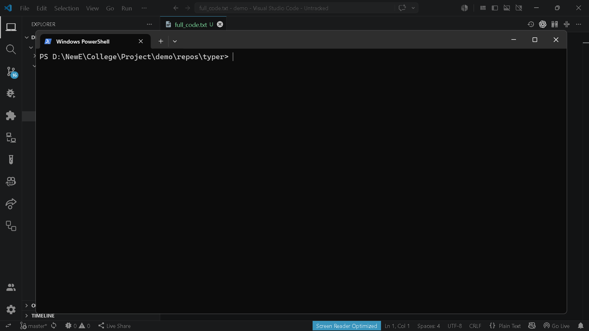

# `brain export dir`

> Manually add a directory to export

---

## Overview

Manually add a directory to export

---

## When to use

This command is part of the **export** workflow.

---

## Syntax

```bash
brain export dir [options]
```

---

## Parameters

| Parameter | Type | Required | Default | Description |
|-----------|------|:--------:|---------|-------------|
| `path` | `str` | ✓ | `—` | Directory path to include |

---

## Examples

```bash
brain export dir src/
```

---

## Outputs

- `.brain/exports/manual_export.txt`

---

## Errors

_None_

---

## Related commands

- `brain export full-code`
- `brain export file`

---

## Notes

- Adds directory recursively into export bundle.

---

## Edge cases

- Large directories increase export size.

---

## Demo




---

## Usage Guide

### When would I use this?

Use this command when you need to selectively include a specific directory—such as a module, library, or configuration folder—into your export bundle without exporting the entire project codebase.

### How it fits in the workflow

1. Identify a specific directory containing necessary assets or source code.
2. Run `brain export dir <path>` to register the path.
3. The command updates `.brain/exports/manual_export.txt` to include the specified directory recursively.
4. Execute your primary export command (e.g., `brain export full-code`) to bundle the registered directories.

### Practical tips

*   **Targeting sub-modules:** Use this to isolate specific feature directories if you are working on a multi-repo or large monolithic project.
*   **Documentation bundling:** Include a `docs/` folder alongside your source code to ensure context is captured in the generated export.
*   **Workflow automation:** Add this command to your environment initialization scripts if you frequently export the same custom directories.

### Common failure causes

*   **Invalid Path:** Providing a non-existent path or a file path instead of a directory path may result in an empty export or an error.
*   **Permission Denied:** Ensure your user account has read access to the specified directory.
*   **Exceeding Limits:** Attempting to export extremely large directories (e.g., `node_modules` or `build` folders) can lead to export failures or time-outs.

### FAQ

**Does this export files recursively?**
Yes, `brain export dir` adds the directory and all of its contents recursively into your export configuration.

**Will this override existing exports?**
It appends the directory to the `.brain/exports/manual_export.txt` file; it does not clear existing manual entries.

**Can I export individual files using this?**
No, this command is specifically for directories. Use `brain export file` for individual files.

**How do I remove a directory once added?**
You can manually edit the `.brain/exports/manual_export.txt` file to remove the path line.
