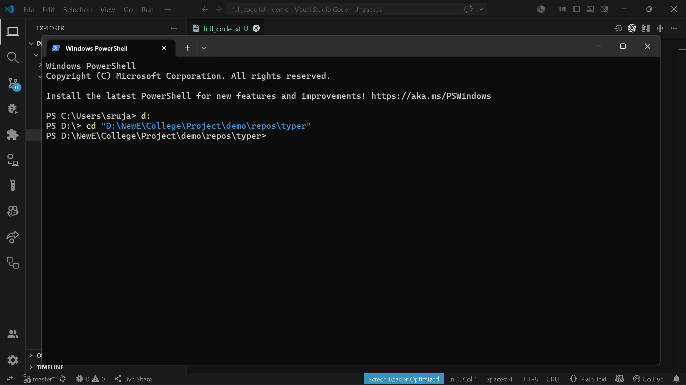

# `brain export file`

> Manually add a single file to export

---

## Overview

Manually add a single file to export

---

## When to use

This command is part of the **export** workflow.

---

## Syntax

```bash
brain export file [options]
```

---

## Parameters

| Parameter | Type | Required | Default | Description |
|-----------|------|:--------:|---------|-------------|
| `path` | `str` | ✓ | `—` | File path to include |

---

## Examples

```bash
brain export file src/main.py
```

---

## Outputs

- `.brain/exports/manual_export.txt`

---

## Errors

_None_

---

## Related commands

- `brain export full-code`
- `brain export dir`

---

## Notes

- Adds a single file into export bundle.

---

## Edge cases

- File must exist.

---

## Demo




---

## Usage Guide

### When would I use this?

Use this command when you need to selectively include a specific source file in your project export bundle without including the entire directory or repository. This is ideal for isolating specific modules, configuration files, or documentation pieces for targeted review or sharing.

### How it fits in the workflow

This command acts as a granular control mechanism within the `brain export` ecosystem. After identifying specific files that require external analysis or backup, you run `brain export file` to add them to the `.brain/exports/manual_export.txt` manifest. It functions as a precise alternative to `brain export full-code` or `brain export dir`, allowing you to curate the final export contents incrementally.

### Practical tips

*   **Verify paths:** Ensure the path provided is relative to the project root to maintain consistency in your manifest.
*   **Incremental addition:** You can run the command multiple times to build a customized export list; each execution appends the specified file to `manual_export.txt`.
*   **Manifest review:** Always inspect the contents of `.brain/exports/manual_export.txt` after using this command to confirm that the expected files have been correctly registered.

### Common failure causes

*   **Non-existent files:** The command will fail if the provided file path does not point to an existing file in the current working directory.
*   **Permissions:** Lack of write access to the `.brain/exports/` directory will prevent the command from updating the manifest.
*   **Typographical errors:** Incorrect file paths will result in a failure to locate the resource, preventing it from being consumed by the export process.

### FAQ

**Can I export multiple files at once?**
No, this command is designed to add one file at a time. To include multiple files, execute the command sequentially for each file path.

**Where does the file information go?**
The command tracks your selections by updating the `.brain/exports/manual_export.txt` file, which serves as the registry for your manual export bundle.

**What happens if I run the command twice on the same file?**
The system will attempt to register the file again. Depending on the implementation of the manifest writer, it may either ignore the duplicate or create redundant entries; ensure your workflow accounts for unique file selections.

**Does this command move the file?**
No, this command only registers the file path within the export system's manifest. It does not alter, move, or duplicate the actual source file until the final export process is triggered.
