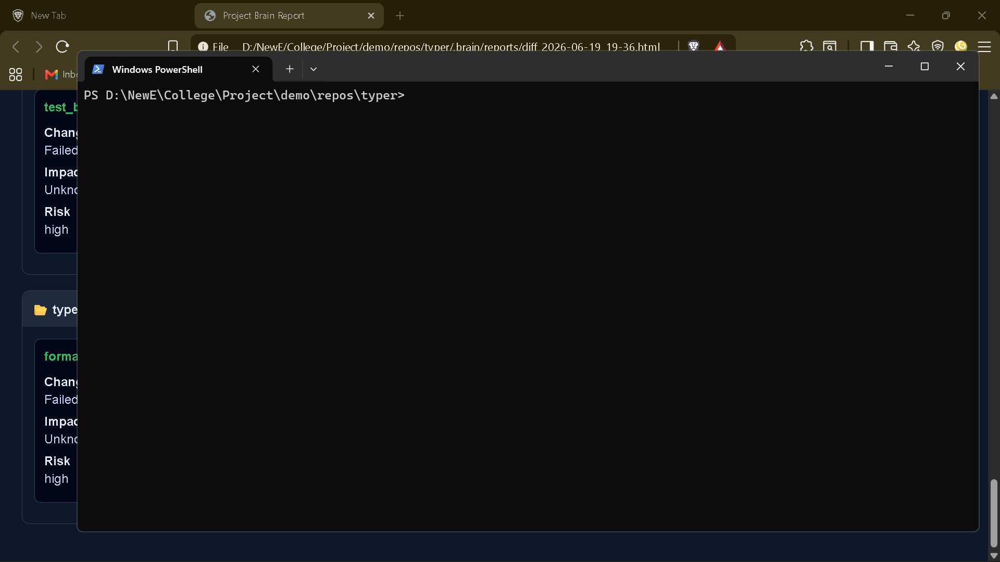

# `brain export full-code`

> Export entire codebase into structured file

---

## Overview

Export entire codebase into structured file

---

## When to use

This command is part of the **export** workflow.

---

## Syntax

```bash
brain export full-code [options]
```

---

## Parameters

_No parameters._

---

## Examples

```bash
brain export full-code
```

---

## Outputs

- `.brain/exports/full_code.txt`

---

## Errors

_None_

---

## Related commands

- `brain export file`
- `brain export dir`

---

## Notes

- Exports repository into AI-friendly format.

---

## Edge cases

- Large repositories generate large export files.

---

## Demo




---

## Usage Guide

### When would I use this?

Use `brain export full-code` when you need to provide an AI model or external collaborator with the complete context of an entire repository. It is ideal for code reviews, architectural analysis, refactoring tasks, or when you require the AI to understand dependencies and cross-file interactions across the codebase.

### How it fits in the workflow

1.  **Preparation**: Navigate to the root directory of your project.
2.  **Execution**: Run `brain export full-code` to aggregate the codebase.
3.  **Consumption**: Use the resulting `.brain/exports/full_code.txt` as a system prompt, context window input, or attachment for an AI assistant to analyze the structural state of the project.
4.  **Integration**: Leverage the exported file to perform global searches or logic verification that necessitates visibility into multiple modules simultaneously.

### Practical tips

*   **Cleanup**: Before running the command, ensure your repository is clean of unnecessary build artifacts or binary files to reduce the size of the generated text file.
*   **Version Control**: Run this command periodically to maintain an up-to-date snapshot of your project state for historical tracking or AI-assisted debugging sessions.
*   **Large Repositories**: Be aware of token limits. If your repository is exceptionally large, consider using `brain export file` or `brain export dir` to export specific sub-components instead of the full codebase.

### Common failure causes

*   **Insufficient Permissions**: Running the command in a directory where the system lacks write access to create the `.brain/exports/` directory.
*   **Disk Space**: Running the command on a system with insufficient storage to hold the aggregated text file if the repository contains significant amounts of raw data.
*   **Interrupts**: Terminating the process prematurely, which may result in a partial or corrupted `full_code.txt` file.

### FAQ

**Q: Does this command include hidden files or configuration files?**
A: It captures the repository source code according to the internal configuration defined by the tool.

**Q: Where is the output saved?**
A: The file is produced at `.brain/exports/full_code.txt`.

**Q: Can I change the output filename?**
A: No, the current implementation strictly produces the file at the default path.

**Q: Is the output compressed?**
A: No, the output is a plain-text format designed to be AI-friendly.
