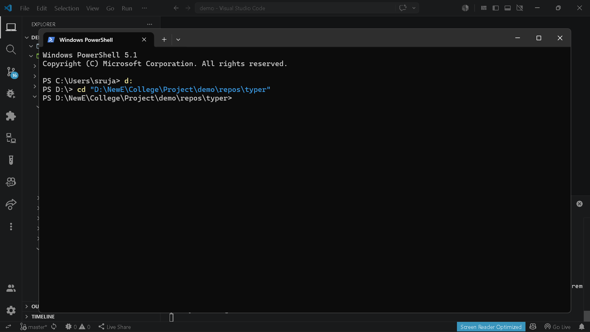

# `brain export tree`

> Export repository tree structure into tree and JSON formats.

---

## Overview

Export repository tree structure into tree and JSON formats.

---

## When to use

This command is part of the **export** workflow.

---

## Syntax

```bash
brain export tree [options]
```

---

## Parameters

_No parameters._

---

## Examples

```bash
brain export tree
```

---

## Outputs

- `.brain/exports/project_structure.tree`
- `.brain/exports/project_structure.json`

---

## Errors

_None_

---

## Related commands

- `brain export full-code`
- `brain project analyze`

---

## Notes

- Exports repository folder structure.
- Generates both tree and JSON formats.

---

## Edge cases

- Large repositories generate large JSON output.

---

## Demo




---

## Usage Guide

### When would I use this?

Use `brain export tree` when you need a standardized overview of a project's directory hierarchy. It is ideal for documenting project architecture, generating visual representations of file organization for onboarding, or creating snapshots of repository structures for auditing and planning purposes.

### How it fits in the workflow

This command acts as a documentation and discovery step. It consumes your repository source code to produce structured files that serve as references for other tools. You would typically execute this during the initial analysis phase of a project or before generating a full codebase export to ensure you have a clear mapping of the filesystem.

### Practical tips

*   Run this command immediately after cloning a new repository to establish a baseline of the project structure.
*   The generated files `.brain/exports/project_structure.tree` and `.brain/exports/project_structure.json` can be committed to version control to track architectural changes over time.
*   Integrate the JSON output into custom scripts if you need to programmatically parse file paths or identify directory depth.

### Common failure causes

*   **Insufficient Permissions:** Lacking read access to specific subdirectories within the repository source code can result in an incomplete export.
*   **Storage Constraints:** In extremely large repositories, the `.brain/exports/project_structure.json` file can become disproportionately large, potentially triggering disk space or memory issues in resource-constrained environments.
*   **Path Conflicts:** Filesystem locks or corrupted symbolic links within the source tree may cause the export process to stall.

### FAQ

**Does this command export the actual contents of my files?**
No. It only maps the file paths and folder hierarchy. To export actual file contents, use `brain export full-code`.

**Where can I find the results?**
The command produces two files: `.brain/exports/project_structure.tree` for human-readable viewing and `.brain/exports/project_structure.json` for machine-readable data processing.

**Does this command require internet access?**
No, it operates entirely on the local repository source code.
