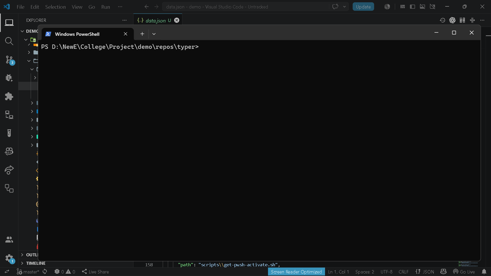

# `brain project summary`

> Summarize the analyzed data

---

## Overview

Summarize the analyzed data

---

## When to use

This command is part of the **project** workflow.

---

## Syntax

```bash
brain project summary [options]
```

---

## Parameters

_No parameters._

---

## Examples

```bash
brain project summary
```

---

## Outputs

- `terminal summary`

---

## Errors

_None_

---

## Related commands

- `brain project analyze`

---

## Notes

- Displays summarized repository analysis.

---

## Edge cases

- Requires previous analysis.

---

## Demo




---

## Usage Guide

### When would I use this?

Use this command when you need to view a concise, high-level overview of a project's repository analysis. It is intended to provide immediate insights after the data has been processed by the analysis engine.

### How it fits in the workflow

1. Execute `brain project analyze` to process the repository and generate the required data file.
2. Run `brain project summary` to parse the `.brain/data.json` file and display the distilled findings in the terminal.

### Practical tips

* Ensure you have performed a fresh analysis before running the summary to reflect the most recent state of the codebase.
* Use the terminal output to quickly identify key metrics or bottlenecks without manually inspecting large JSON files.
* Pipe the output to other terminal utilities (e.g., `grep` or `less`) if the summary exceeds the visible buffer length.

### Common failure causes

* **Missing Data:** Attempting to run the command before `brain project analyze` has successfully created the `.brain/data.json` file.
* **Corrupted Cache:** The underlying `.brain/data.json` file has been modified or corrupted by an external process, preventing the parser from reading it.
* **Insufficient Permissions:** The user lacks read access to the `.brain/` directory or the data file within it.

### FAQ

**Does this command modify my source code?**
No, it is a read-only operation that accesses the JSON data generated during the analysis phase.

**Can I export this summary to a file?**
The command produces a terminal summary; however, you can redirect the output to a text file using standard shell operators (e.g., `brain project summary > summary.txt`).

**Why is the output empty?**
If the command executes without returning information, verify that the `brain project analyze` process completed successfully and that `.brain/data.json` is not empty.
