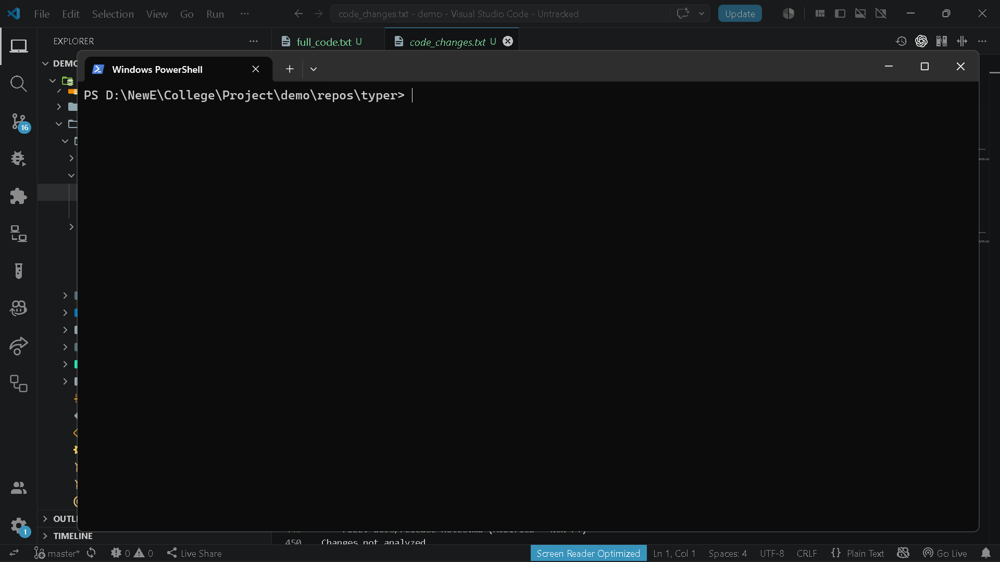

# `brain testllm test`

> Test configured LLM provider connectivity.

---

## Overview

Test configured LLM provider connectivity.

---

## When to use

This command is part of the **testllm** workflow.

---

## Syntax

```bash
brain testllm test [options]
```

---

## Parameters

_No parameters._

---

## Examples

```bash
brain testllm test
```

---

## Outputs

_None_

---

## Errors

| Code | Description |
|------|-------------|
| `LLM_PROVIDER_FAILURE` | LLM provider request failed. |

---

## Related commands

- `brain diff review`

---

## Notes

- Verifies configured LLM provider connectivity.

---

## Edge cases

- Provider must be configured in brain.yaml.

---

## Demo




---

## Usage Guide

### When would I use this?

Use this command to verify that your environment is correctly connected to the configured Large Language Model (LLM) provider. This is essential after performing initial setup, modifying provider credentials, or when troubleshooting unexpected errors during LLM-based operations.

### How it fits in the workflow

The `brain testllm test` command acts as a diagnostic gateway. It should be executed after updating your `brain.yaml` file to ensure the configuration is valid before attempting complex tasks like code reviews or documentation generation. It confirms the handshake between the local application and the remote API before you consume credits or process data.

### Practical tips

*   **Pre-execution check:** Always ensure that `brain.yaml` contains the correct API keys and endpoint configurations before running this command.
*   **Environment isolation:** If you have multiple environments, ensure you are running this command within the correct context to verify the specific provider settings for that deployment.
*   **Dependency validation:** Run this command following any network environment changes (e.g., enabling a corporate VPN or proxy) to ensure the provider connectivity remains intact.

### Common failure causes

*   **LLM_PROVIDER_FAILURE:** This error typically indicates that the API key is invalid, expired, or has insufficient permissions to perform the requested operations.
*   **Missing Configuration:** The provider settings are absent or malformed within `brain.yaml`.
*   **Network Restrictions:** The local environment is unable to reach the provider's API endpoints due to firewall settings or lack of internet connectivity.

### FAQ

**Does this command send data to the LLM?**
No, it performs a lightweight connectivity check to verify that the provider is reachable and the credentials are valid; it does not process task-specific data.

**Do I need to restart the application after updating the configuration?**
Yes, ensure the updated `brain.yaml` is saved and the application state is refreshed before running the test to ensure the command reads the latest configuration.

**What should I do if the test fails?**
First, check your `brain.yaml` file for typos in the configuration. Second, verify your internet connection. If those are correct, verify that your API key is still active in your provider's dashboard.
